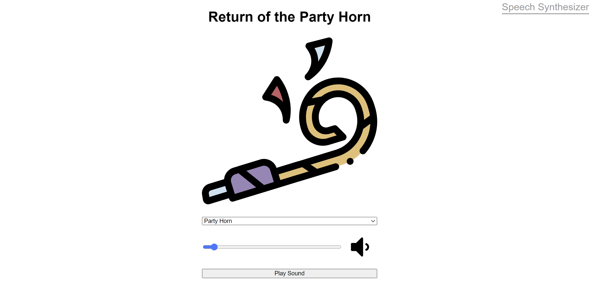
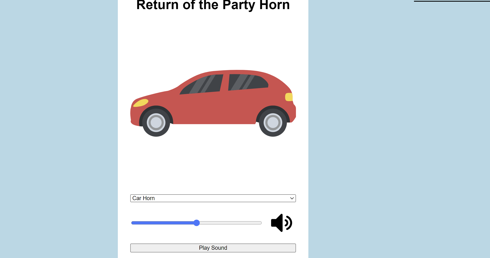
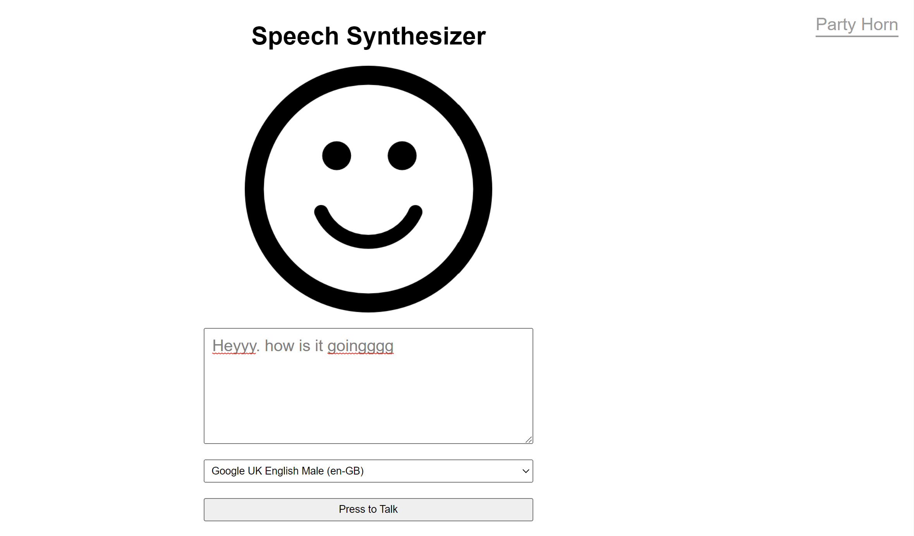
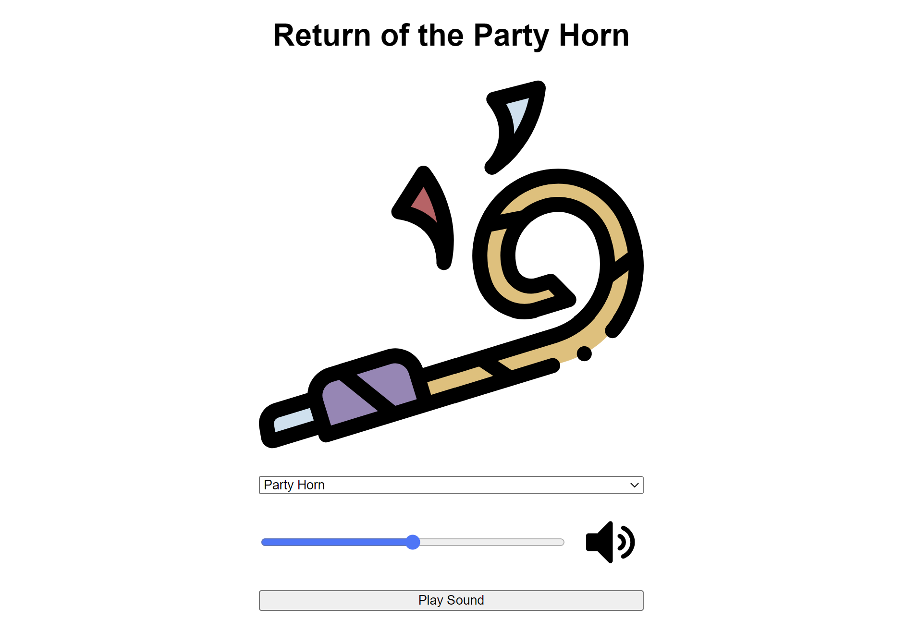

# Party horn and speech synthesis
This app allows you to choose either a horn, or a car or a party sound and it will play it for you and you can control the volume live. there will be a conffetti affect on the screen when you choose the party horn to be blown. the other feature is text to speech synthesis that allows users to write anything and choose any voice they like so the text inputed will be read to them in that particular voice they like.

## Features

- Basic Node.js/Express server setup
- Example API endpoints for retrieving and adding data
- Basic HTML and CSS for a simple front-end
- Text to speech feature or speech senthesis
- when the text is being read by the speech, the imoji mouth moves as well
- its fully responsive
- apis are used for the conffetti, speech, voice and other features

## Installation

To run the application locally, follow these steps:

1. Clone the repository: `git clone https://github.com/naseralemi12/Lab10_Starter.git`
2. Install dependencies: `npm install`
3. Start the server: `npm start`

## Usage

To use the application, follow these steps:

1. Open a web browser and navigate to `http://localhost:3000`.
2. Use the provided form to add new data.
3. Use the provided buttons to retrieve data from the server.

## Contributing

If you would like to contribute to this project, feel free to submit a pull request or open an issue.

## Video Demo <https://youtube.com/shorts/UzuHw0_W7IA>

## Screenshots

